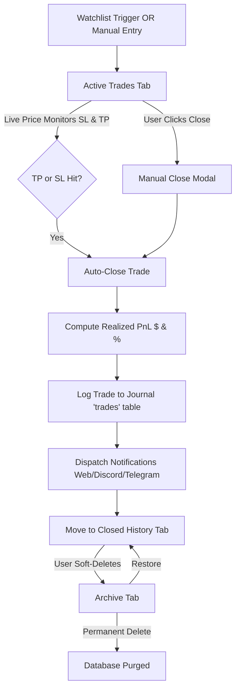

# Trades Page & Position Management System

The **Trades Page** (`/trades`) provides live position tracking, manual trade creation, trade execution management, auto TP/SL hit monitoring, automatic journal logging, and trade archiving.

---

## 📌 Overview & Key Features

1. **3-Tab Navigation Architecture**:
   - **Active Trades**: Running position alerts with live prices, position sizing, margin, leverage, UPNL ($ & %), TP/SL level indicators, manual edit, manual close, and archive actions.
   - **Closed History**: Completed trades table with final Exit Price, Realized PnL ($ and %), Exit Reason (`TP Hit`, `SL Hit`, `Manual Close`), Closed Date, and soft-delete archiving.
   - **Archive**: Soft-deleted trades table with **Restore (↩)** (returns item to Active or Closed History) and **Delete Permanently (🗑)** actions.

2. **Manual Trade Entry (`+ Manual Trade`)**:
   - Create trades directly on the Trades page without requiring prior Watchlist triggers (e.g. for market or limit orders executed manually outside the app).
   - Requires manual entry for symbol, direction (`Long` / `Short`), entry price, stop loss, take profit, margin ($), leverage (x), order type, and notes.

3. **Interactive Manual Trade Closure**:
   - Clicking **Close** on an active trade opens a quick modal pre-filled with the live MEXC market price.
   - Displays live preview of Realized PnL ($) and PnL (%) dynamically as exit price is confirmed or adjusted.
   - Submitting updates trade status to `closed`, logs the finished trade into the user's primary **Journal** (`trades` table), and dispatches notifications.

4. **Automated TP/SL Hit Detection & Journaling**:
   - Background poller (`/api/trade-alerts/check`) checks active trades against MEXC prices.
   - When live price crosses SL or TP:
     1. Claims level atomically.
     2. Sets trade status to `closed` with exit price and calculated realized PnL.
     3. Writes an entry directly to the **Journal** (`trades` table) with post-trade review notes.
     4. Dispatches multi-channel alert notifications (in-app, desktop toast, Discord webhooks, Telegram bots).

5. **Soft-Delete Trade Archiving**:
   - Delete action on Active Trades or Closed History soft-deletes the row into `archived_trade_alerts`.
   - Restoring moves the item back to `trade_alerts` preserving its active or closed status.
   - Permanent delete purges the record from the database.

---

## 🔄 Trade Lifecycle Workflow

---

## 🗄️ Database Schema & Migrations

### `trade_alerts` Table (`009`, `010`, `011`, `015`)
- `id` (UUID, Primary Key)
- `user_id` (UUID, Foreign Key)
- `symbol` (TEXT)
- `trigger_direction` (`'above'` | `'below'`)
- `entry_price`, `stop_loss`, `take_profit` (NUMERIC)
- `margin_usd`, `leverage` (NUMERIC)
- `sl_fired_at`, `tp_fired_at` (TIMESTAMPTZ)
- `status` (`'active'` | `'closed'`)
- `closed_reason` (`'tp_hit'` | `'sl_hit'` | `'manual_close'`)
- `exit_price` (NUMERIC)
- `closed_at` (TIMESTAMPTZ)
- `realized_pnl_usd`, `realized_pnl_pct` (NUMERIC)

### `archived_trade_alerts` Table (`015`)
- `id` (UUID, Primary Key)
- `user_id` (UUID, Foreign Key)
- `original_trade_alert_id` (UUID)
- `symbol` (TEXT)
- `trigger_direction`, `entry_price`, `exit_price`, `stop_loss`, `take_profit`
- `status_at_archive` (`'active'` | `'closed'`)
- `closed_reason`, `realized_pnl_usd`, `realized_pnl_pct`
- `archived_at` (TIMESTAMPTZ)
