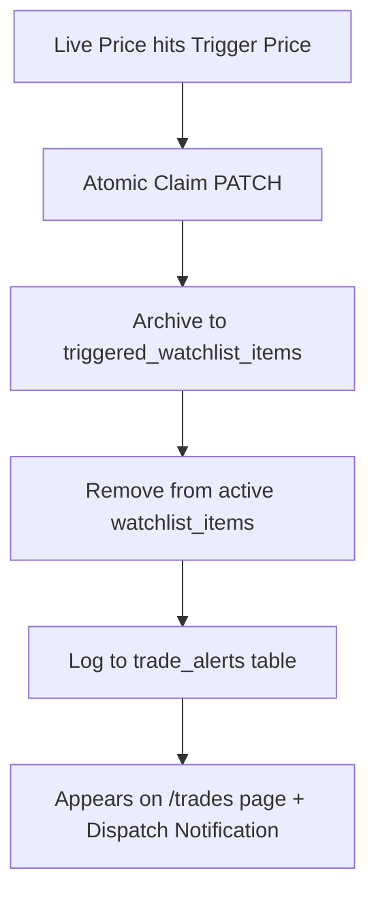
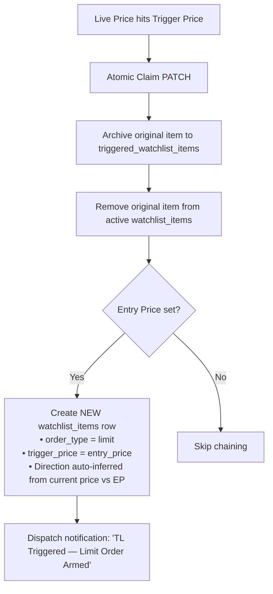

# Futures Watchlist & Trigger Engine

The **Futures Watchlist** is a real-time market tracking and trade plan trigger system integrated with MEXC USDT-perpetual futures. It allows traders to define precise trigger conditions and trade plans, automatically archiving triggered tokens and chaining orders based on user-defined order types.

---

## 📌 Overview & Features

1. **Real-time MEXC Market Radar**:
   - Live ticker updates (price, 24h change, 24h volume) polled at configurable intervals.
   - Quick search across MEXC USDT-perpetual futures contracts.

2. **Dual-Tab Architecture**:
   - **Watchlist (Active)**: Armed tokens actively watching live prices for trigger conditions.
   - **Triggered (Archive)**: Tokens whose trigger conditions have been met.

3. **Trade Plan & Order Types**:
   - **Trigger Price**: The price condition that arms/fires the alert (`above` or `below`).
   - **Entry Price (EP)**, **Stop Loss (SL)**, **Take Profit (TP)**: Trade parameters.
   - **Order Types**:
     - `Limit`: Standard limit order plan.
     - `Trigger Limit`: Two-stage order chaining.
     - `Market`: Immediate market order plan.

4. **Multi-Instance Token Support**:
   - Traders can create and monitor **multiple independent setups for the same coin** simultaneously (e.g., separate dip-buy `Limit` and breakout `Trigger Limit` setups for `BTC`).
   - Ticker polling automatically deduplicates symbols so market data requests remain lean.
   - Moving an item back from the Triggered tab creates a new active entry without overwriting or colliding with existing active setups for that coin.

---

## 🔄 Trigger Execution Lifecycles

### 1. Standard Triggers (`Limit` / `Market`)

When live MEXC prices hit the configured `trigger_price`:
1. The row is marked fired atomically (preventing duplicate triggers across tabs).
2. The item moves from **Watchlist** to **Triggered**.
3. A trade alert row is logged in `trade_alerts`, making it immediately visible on the `/trades` page.
4. Notifications are dispatched via configured channels (in-app bell, desktop toast, Discord webhook).

---

### 2. Trigger Limit Chaining (`Trigger Limit`)

When a `Trigger Limit` item fires:
1. The original item moves to **Triggered**.
2. A **new watchlist item** is automatically spawned in the active watchlist with:
   - `trigger_price` set to the original **Entry Price (EP)**.
   - `order_type` updated to `limit`.
   - `trigger_direction` auto-inferred from live price vs EP (`below` if current price > EP, `above` if current price < EP).
3. **No `/trades` row is logged yet** — the token remains in the active watchlist until the new Limit trigger (at EP) is reached.

---

## 📂 Triggered Tokens Tab (Archive)

The **Triggered** tab maintains a permanent record of all fired tokens and their trade plans at the exact moment of execution.

### Displayed Information
- **Coin**: Base asset symbol (e.g., `BTC`, `SOL`).
- **Side**: `LONG` (if trigger direction was `below`) or `SHORT` (if trigger direction was `above`).
- **Order Type**: `Trigger Limit`, `Limit`, or `Market`.
- **Trigger Px**: Price condition configured by the user.
- **Fired Px**: Actual MEXC last price at trigger execution.
- **Fired At**: Timestamp of trigger in Singapore Time (`SGT`).
- **EP / SL / TP**: Trade plan parameters.
- **Notes**: Trade thesis or notes saved with the item.

### Actions
- **Move Back (↩)**: Re-creates the item back into the active watchlist with its full trade plan intact, clearing it from the archive.
- **Delete (🗑)**: Permanently removes the record from the database archive.

---

## 🗄 Database & API Reference

### Tables

1. **`watchlist_items`**: Active watchlist items currently monitored by the watcher.
   - Key columns: `id`, `user_id`, `symbol`, `trigger_price`, `trigger_direction`, `entry_price`, `stop_loss`, `take_profit`, `order_type`, `notes`.

2. **`triggered_watchlist_items`**: Permanent archive of fired tokens.
   - Key columns: `id`, `user_id`, `source_item_id`, `symbol`, `trigger_price`, `trigger_direction`, `fired_price`, `entry_price`, `stop_loss`, `take_profit`, `order_type`, `notes`, `fired_at`.

### API Endpoints

- `GET  /api/watchlist`: Fetch active watchlist items.
- `POST /api/watchlist`: Add/re-create an active watchlist item with trade plan.
- `PATCH /api/watchlist/[id]`: Update trade plan or claim trigger (`alert_fired: true`).
- `DELETE /api/watchlist/[id]`: Remove active item.
- `GET  /api/triggered-watchlist`: Fetch archived triggered tokens.
- `POST /api/triggered-watchlist`: Insert a new archived item on fire.
- `DELETE /api/triggered-watchlist/[id]`: Remove an archived item.
