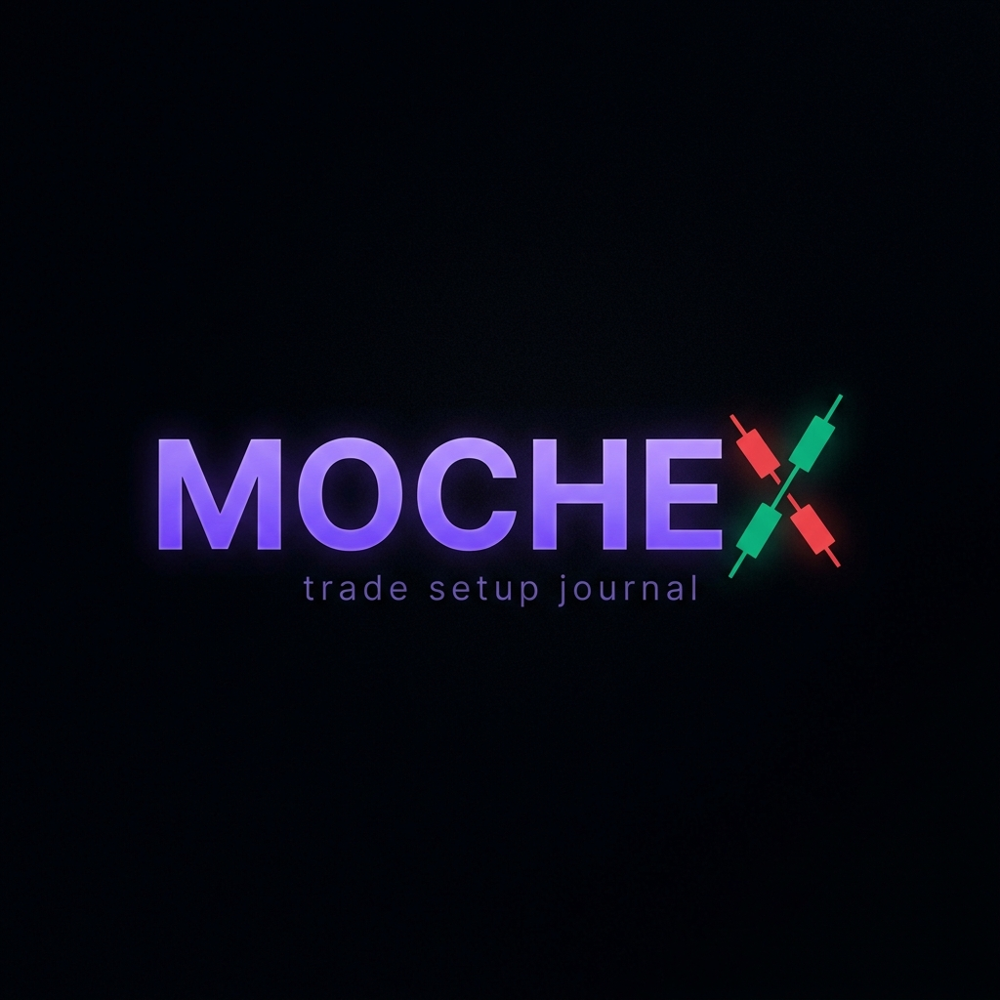
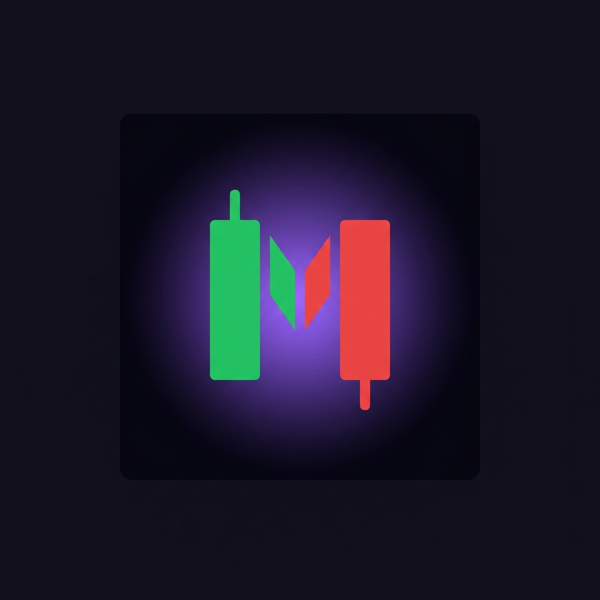
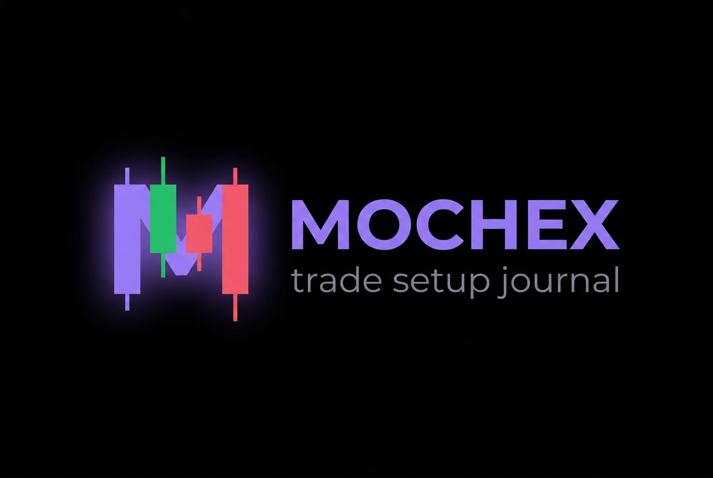

# 🎨 MOCHEX — Branding Guide

**MOCHEX** = Mochi (your Discord web3 community) + MEXC

---

## 🖼️ Logo Concepts

### Concept 1: Wordmark with Candlestick X
The "X" in MOCHEX is formed by crossing candlestick wicks — green (bullish) going up, red (bearish) going down.

### Concept 2: Favicon / App Icon (Candlestick M)
A stylized "M" formed by two candlestick bars — one green bullish, one red bearish — with a violet ambient glow. Works perfectly at small sizes like 16x16px or 32x32px.

### Concept 3: Horizontal Logo Lockup
Icon mark (candlestick M) + wordmark side-by-side. Ideal for the main navigation bar, social media banners, and standard branding uses.

---

## ✍️ Tagline Options

| Tagline | Vibe |
|---|---|
| *Trade setup journal* | Clean, descriptive, to the point |
| *Your edge, documented.* | Professional, trader mindset |
| *Plan. Track. Prove.* | Action-oriented, confident |
| *From Mochi, for the culture.* | Community-first, Web3 native |

---

## 🎨 Brand Identity

Your existing design system maps perfectly to the new MOCHEX brand:

| Element | Value | Notes |
|---|---|---|
| **Primary Accent** | `#8b5cf6` (Violet) | Distinctive, not generic crypto blue |
| **Dark Background** | `#0a0913` | Near-black with violet tint |
| **Gain Color** | `#34d399` (Emerald) | Standard bullish green |
| **Loss Color** | `#fb7185` (Rose) | Standard bearish red |
| **Brand Font** | Newsreader italic | Editorial, authoritative |
| **UI Font** | IBM Plex Sans | Clean, professional |
| **Mono Font** | IBM Plex Mono | Data-forward numbers |
